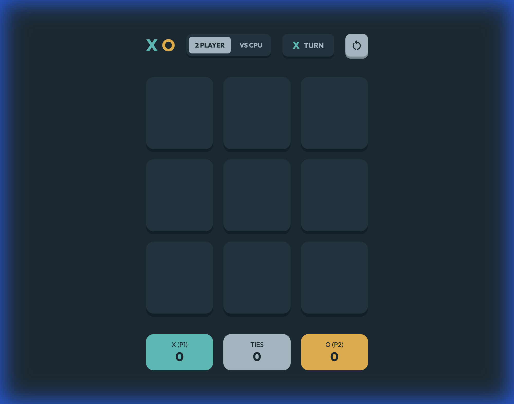

# Modern Tic-Tac-Toe Game

A sleek, modern, and responsive Tic-Tac-Toe game built entirely with vanilla HTML, CSS, and JavaScript.

**[🎮 Play the Live Demo](https://alfredang.github.io/tic-tac-toe-game/)**


<!-- Preview showing the modern UI and Game Mode toggle -->

## Features

- **Modern UI/UX**: Clean dark-mode interface with soft shadows, rounded corners, and smooth transitions.
- **Responsive Design**: Fully functional on both desktop and mobile devices.
- **Interactive Gameplay**:
  - **[NEW] Single Player Mode (vs CPU)**: Challenge an unbeatable AI opponent.
  - Two-player local mode (X vs O).
  - Visual indicators for player turns.
  - Animated win lines/glow effects.
  - Modal popups for round results (Win or Tie).
- **Sound Effects**: Integrated audio cues for clicks, wins, draws, and resets.
- **Stat Tracking**: Keeps track of wins for Player X, Player O, and Ties during the session.

## Code Structure

The project is organized into clear, separate concerns:

- **`index.html`**:
  - Contains the semantic HTML5 structure.
  - Organized into Header, Game Board, and Stats sections.
  - Includes specific data attributes (e.g., `data-index`) for easy JavaScript targeting.

- **`css/style.css`**:
  - Uses **CSS Custom Properties (Variables)** for consistent theming (`--bg-color`, `--color-x`, etc.).
  - Utilizes **CSS Grid** for the value board layout and **Flexbox** for alignment.
  - Handles **Animations** for modals and hover states.

- **`javascript/script.js`**:
  - **State Management**: Uses a simple array `SQUARES` to track board state and variables for scores/turn.
  - **Game Logic**: Functions like `checkWin()` and `isDraw()` evaluate the game state after every move.
  - **DOM Manipulation**: Clean separation where UI updates (classes, text) are handled based on state changes.
  - **Event Listeners**: Handles user interactions (clicks, resets) efficiently.

## Installation & Setup

1. **Clone the repository:**
   ```bash
   git clone https://github.com/alfredang/tic-tac-toe-game.git
   ```

2. **Navigate to the directory:**
   ```bash
   cd tic-tac-toe-game
   ```

3. **Run the game:**
   - Simply open `index.html` in your preferred web browser.
   - Alternatively, use a local server (like Live Server in VS Code) for the best experience.

## 🐳 Docker

### Quick Start (from Docker Hub)

Pull and run the pre-built image directly from Docker Hub:

```bash
docker pull tertiaryinfotech/tic-tae-toe
docker run -d -p 8080:80 --name tic-tae-toe tertiaryinfotech/tic-tae-toe
```

Then open [http://localhost:8080](http://localhost:8080) in your browser.

### Build Locally

If you prefer to build the Docker image from source:

```bash
git clone https://github.com/alfredang/tic-tac-toe-game.git
cd tic-tac-toe-game
docker build -t tic-tae-toe .
docker run -d -p 8080:80 --name tic-tae-toe tic-tae-toe
```

### Docker Commands Reference

| Command | Description |
|---------|-------------|
| `docker stop tic-tae-toe` | Stop the container |
| `docker start tic-tae-toe` | Restart the container |
| `docker rm -f tic-tae-toe` | Remove the container |
| `docker logs tic-tae-toe` | View container logs |

## Assets

Audio files are linked in the code. To enable sound, place your `.mp3` files in `assets/sounds/` with the following names:
- `click-x.mp3`
- `click-o.mp3`
- `win.mp3`
- `draw.mp3`
- `restart.mp3`
